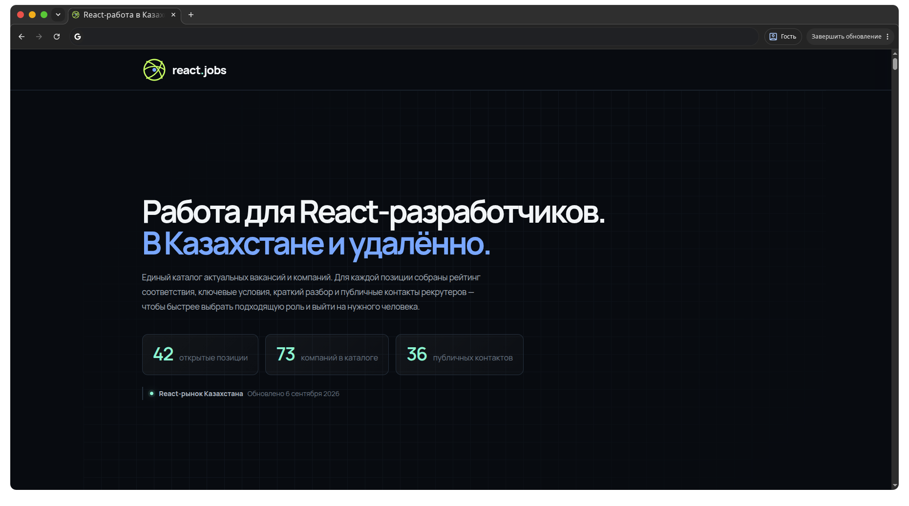

# react.jobs — React-вакансии в Казахстане

Каталог актуальных вакансий для **React-разработчиков в Казахстане и на удалёнке**.

Проект собирает в одном месте вакансии, компании и публичные контакты рекрутеров, чтобы не искать информацию по десяткам карьерных сайтов, LinkedIn-профилей и Telegram-каналов.

### → [Открыть каталог](https://goldextremal.github.io/kz-jobs/)

---

## Что внутри

Для компаний и вакансий собрана основная информация, полезная при поиске работы:

* актуальные React / Frontend вакансии;
* позиции в **Астане**, **Алматы** и на **удалёнке**;
* React Native и смежные Full-stack позиции;
* краткое описание требований;
* технологии и стек;
* формат работы;
* ссылки на вакансии и карьерные страницы;
* публичные контакты HR и рекрутеров;
* рейтинг позиций для быстрой приоритизации откликов.

Каталог можно фильтровать по наличию вакансий, контактам, городу и типу позиции.

---

## Возможности

### Поиск

Можно искать по:

* названию компании;
* вакансии;
* технологиям и стеку.

### Фильтры

Доступны быстрые фильтры:

* есть открытая вакансия;
* есть публичный контакт;
* удалённая работа;
* Астана;
* Алматы;
* только Frontend;
* React Native;
* Full-stack.

### Сортировка

Компании можно сортировать:

* по рейтингу;
* сначала с открытыми вакансиями;
* сначала с контактами;
* по названию.

---

## Источники

Для поиска и проверки вакансий используются открытые источники, в том числе:

* [hh.kz](https://hh.kz/)
* [Astana Hub](https://astanahub.com/ru/vacancy)
* [LinkedIn Jobs](https://www.linkedin.com/jobs/)
* [WorkBench.kz](https://workbench.kz/jobs/)
* [Enbek.kz](https://www.enbek.kz/)
* [Хабр Карьера](https://career.habr.com/)

Также используются официальные карьерные страницы компаний и публично размещённые контакты рекрутеров.

> Каталог не является официальным представителем перечисленных компаний. Информация собирается из открытых источников и со временем может устаревать.

---

## Обновление каталога

При обновлении данных желательно проверять:

1. открыта ли вакансия;
2. работает ли ссылка на неё;
3. актуален ли указанный формат работы;
4. не изменился ли стек или уровень позиции;
5. остаётся ли контакт рекрутера публичным и актуальным;
6. соответствует ли карточка компании текущему состоянию рынка.

Также после крупного обновления стоит изменить дату актуальности на странице.

---

## Добавить вакансию или исправить данные

Если вы нашли:

* новую React-вакансию в Казахстане;
* компанию, которой нет в каталоге;
* устаревшую вакансию;
* неработающую ссылку;
* ошибку в данных;
* публичный контакт рекрутера;

можно открыть **Issue** или отправить **Pull Request**.

При добавлении вакансии желательно приложить ссылку на первоисточник.

---

## Зачем этот проект

Поиск React-вакансий в Казахстане распределён между несколькими площадками: часть компаний публикуется на hh.kz, часть — в LinkedIn, часть — на Astana Hub или только на собственных карьерных страницах.

`react.jobs` сводит эти данные в один каталог и помогает быстрее ответить на три вопроса:

**Куда подаваться?
Какие позиции подходят лучше всего?
С кем можно связаться напрямую?**

